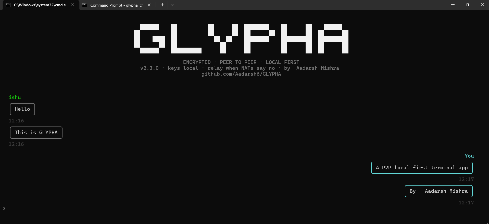
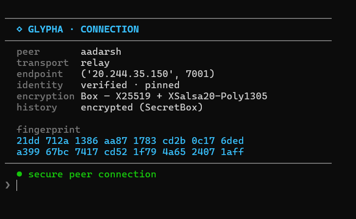
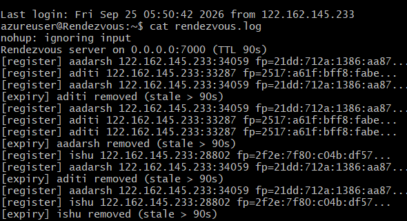

<p align="center">
  
</p>

<p align="center">
<b>ENCRYPTED · PEER-TO-PEER · LOCAL-FIRST</b><br>
<sub>sockets up · keys local · relay when NATs say no</sub>
</p>

<p align="center">
  <a href="https://pypi.org/project/glypha/"></a>
  <a href="https://pypi.org/project/glypha/"></a>
  <a href="https://pypi.org/project/glypha/"></a>
  <a href="#testing"></a>
  <a href="LICENSE"></a>
  <a href="https://github.com/Aadarsh6/GLYPHA/stargazers"></a>
</p>

<p align="center">
  <a href="#quick-start">Quick Start</a> ·
  <a href="#how-it-works">How It Works</a> ·
  <a href="#the-nat-experiment">NAT Experiment</a> ·
  <a href="#security-model">Security</a> ·
  <a href="#self-hosting-the-infrastructure">Self-Hosting</a> ·
  <a href="#faq">FAQ</a>
</p>

---

## Why Glypha Exists

Most "build a chat app" tutorials hand you WebRTC or a messaging SDK and never explain what's underneath.

Glypha goes the other direction. It implements the peer-to-peer stack by hand:

- message framing
- cryptographic identity
- encrypted communication
- peer discovery
- NAT traversal
- relay fallback
- encrypted local history
- terminal chat UI

Every layer is readable Python. Every important engineering decision is documented, including the things that failed.

> ⚠️ **Educational project — deliberately not Signal.**
> See the [Security Model](#security-model) for the exact guarantees and limitations.

## Table of Contents

- [Why Glypha Exists](#why-glypha-exists)
- [Features](#features)
- [Quick Start](#quick-start)
- [Screenshots](#screenshots)
- [How It Works](#how-it-works)
- [Architecture](#architecture)
- [Cryptography and Identity](#cryptography-and-identity)
- [The NAT Experiment](#the-nat-experiment)
- [The Night the Internet Attacked](#the-night-the-internet-attacked)
- [Self-Hosting the Infrastructure](#self-hosting-the-infrastructure)
- [Security Model](#security-model)
- [Testing](#testing)
- [Repository Layout](#repository-layout)
- [Version History](#version-history)
- [Roadmap](#roadmap)
- [FAQ](#faq)
- [Contributing](#contributing)
- [License](#license)

## Features

| Feature | Detail |
|---|---|
| 🔒 **End-to-end encryption** | X25519 key exchange + XSalsa20-Poly1305 AEAD through PyNaCl. Messages remain ciphertext even when passing through the relay. |
| 🪪 **Persistent identity** | A stable keypair per peer, stored in `~/.glypha/`. Your SHA-256 public-key fingerprint is your identity. |
| 🤝 **Verify once, then zero prompts** | First contact uses SSH-style TOFU verification. Once pinned, reconnects verify automatically — a key change triggers a loud impersonation warning. |
| 💬 **Terminal chat UI** | Chat bubbles, a wordmark banner, timestamps, connection events, and slash commands. |
| 📜 **Encrypted history** | SQLite stores SecretBox ciphertext rather than plaintext messages. `/history` replays it grouped by sender and day. |
| 🌐 **Discovery by name** | A rendezvous server maps peer names to endpoints and fingerprints. |
| 🧗 **NAT traversal, measured honestly** | The connection ladder attempts direct → coordinated TCP punch → relay, and the punch's real-world limits are documented, not hidden. |
| 🔁 **Blind relay** | The relay only copies encrypted bytes between peers. It holds no cryptographic keys and never parses message content. |
| 🛡️ **Hardened framing** | Length-prefixed frames with a hard 1 MiB limit. Oversized headers are rejected before allocation — this was attacked in production, not just theorized. |
| 🧪 **22 tests** | Protocol, storage, and identity tests, including regressions for every real bug found during development. |

## Quick Start

### Install

```bash
pip install glypha
```

### Configure the rendezvous server

```bash
glypha config glypha.duckdns.org
```

Replace the hostname with your own rendezvous host if you [self-host the infrastructure](#self-hosting-the-infrastructure). You only need to do this once.

### Start a chat

```bash
glypha chat alice bob
```

| Alice | Bob |
|---|---|
| `glypha chat alice bob` | `glypha chat bob alice` |

Both peers display their fingerprints on first contact:

```
• reaching 'bob' via glypha.duckdns.org...
• trying direct to 203.0.113.7:34059...
• direct failed — trying NAT traversal...
• traversal failed — falling back to relay...
● 'bob' verified against pinned key
● connected via relay
```

Compare the fingerprints through a separate channel (a call, a text) and confirm with `yes`. That one-time human check is what pins the identity locally — every later reconnect auto-verifies with no prompt, and a changed key is rejected loudly as a possible impersonation.

### Same-LAN mode

No rendezvous server is required for direct local-network connections. The first machine prints the exact command for the second:

```bash
glypha listen 9999 alice
```

```bash
glypha connect 192.168.1.6 9999 bob
```

## Screenshots

### Chat

<p align="center">
  
</p>

### Connection Status

<p align="center">
  
</p>

### Relay

<p align="center">
  
</p>

## How It Works

The `chat` command walks the connection ladder automatically. The user never chooses a transport and never sees a traceback.

```
glypha chat <me> <peer>
        │
        ▼
1. DIRECT
        │ fails
        ▼
2. PUNCH
        │ fails
        ▼
3. RELAY
        │
        ▼
encrypted chat
```

**1. Direct.** The peer first attempts to connect directly to the endpoint published by the rendezvous server. This works when the peer is directly reachable — on a LAN, or behind a suitable public endpoint.

**2. Coordinated TCP punch.** If direct fails, both peers attempt a coordinated simultaneous open using their observed NAT mappings. This works on some NAT configurations. It does not work universally — see [The NAT Experiment](#the-nat-experiment).

**3. Relay.** If traversal fails, both peers dial *out* to a public relay, which simply splices the two TCP streams:

```
Peer A ──────► Relay ◄────── Peer B
                 │
             opaque bytes
```

The relay cannot decrypt the messages — it doesn't even have a crypto library installed.

## Architecture

```
                 ┌───────────────────────┐
                 │    Rendezvous Server  │   names → endpoints + fingerprints
                 └───────────┬───────────┘
                             │
                     ┌───────┴────────┐
                     ▼                ▼
                ┌────────┐       ┌────────┐
                │ Peer A │◄─────►│ Peer B │   direct, when possible
                └───┬────┘       └────┬───┘
                    │                 │
                    └──────► RELAY ◄──┘        ciphertext only, when NATs refuse
```

Transport stack — every layer implemented, not imported:

```
chat & history
      ↓
peer management         (the auto-fallback ladder)
      ↓
cryptographic identity   (persistent keypairs, fingerprints, pins)
      ↓
PyNaCl Box                X25519 + XSalsa20-Poly1305
      ↓
custom framing            [4-byte big-endian length][payload], 1 MiB cap
      ↓
TCP sockets                blocking, threaded receive
      ↓
IP / NAT / firewall
```

The project deliberately keeps these layers visible instead of hiding them behind a networking SDK.

## Cryptography and Identity

Glypha uses PyNaCl for every cryptographic primitive.

**Transport encryption:**

```
X25519
   ↓
shared secret
   ↓
XSalsa20-Poly1305 AEAD
   ↓
encrypted message
```

The relay only ever sees ciphertext.

**Persistent identity.** Each peer has a persistent keypair under `~/.glypha/`. The public-key fingerprint is `SHA-256(public_key)`. Moving the project directory does not create a new identity.

**Peer verification** follows a TOFU-style model:

```
first contact
     ↓
display fingerprints
     ↓
human compares out-of-band
     ↓
peer accepted
     ↓
fingerprint pinned
     ↓
future connections auto-verify
```

If a pinned key ever changes, Glypha rejects the connection and reports the identity mismatch — it does not silently reconnect.

## The NAT Experiment

Glypha's NAT traversal story is an engineering result, not a claim that traversal always works.

**Setup:** rendezvous + relay on a cloud VM (Central India). Peer A on home Wi-Fi (NAT public `122.162.151.183`). Peer B on a mobile hotspot, behind carrier-grade NAT (`157.49.119.123` — one public IP shared across thousands of subscribers).

| Attempt | Result |
|---|---|
| Uncoordinated direct dial across the Internet | ❌ NAT rejected unsolicited inbound traffic (`WinError 10060`) |
| Simultaneous-open control test (loopback) | ✅ mechanics worked |
| Coordinated punch, home NAT ↔ carrier-grade NAT | ❌ neither NAT delivered the peer's SYNs |
| Relay fallback | ✅ both peers established outbound connections |

The important result is the failure itself: the code performs the traversal attempt correctly while the network topology still prevents it. That's why Glypha uses a relay as the final rung of the connection ladder — the code is right; the networks refuse.

## The Night the Internet Attacked

~48 hours after Glypha's rendezvous server became publicly reachable, internet scanners found it and began sending hostile length headers — the exact flaw that had been documented and deferred since V1 with the trigger "fix when remotely reachable." The trigger fired on schedule: the unpatched receiver attempted multi-gigabyte allocations from a single 4-byte header (`MemoryError` per connection thread).

The fix was a hard cap, already written and waiting:

```
MAX_MESSAGE_SIZE = 1 MiB   →   oversized frames rejected before allocation
```

Deployed to the servers, the attack became silent drops. Shipped to every client in the next release. This is why the framing section doesn't say the cap is theoretical — and why the incident, with before/after logs, lives in the project's engineering log (`project.md`).

## Self-Hosting the Infrastructure

The rendezvous and relay servers ship inside the package. On any public machine:

```bash
pip install glypha
glypha-rendezvous     # port 7000, 90s TTL + 30s refresh
glypha          # port 7001, blind byte-splice
```

Cloud deployment needs both ports open at both firewall layers — the provider's security group/NSG, and the OS firewall (`ufw`, etc.).

### Making the Hostname Stable (DuckDNS)

A cloud VM's public IP can change on restart. A free dynamic-DNS name keeps the rendezvous address stable without a static IP.

1. Sign in at [duckdns.org](https://www.duckdns.org) and add a domain — e.g. `glypha` → `glypha.duckdns.org`.

2. On the VM, create the update script and run it once:
   ```bash
   mkdir -p ~/duckdns
   cat > ~/duckdns/duck.sh << 'EOF'
   #!/bin/sh
   curl -s "https://www.duckdns.org/update?domains=glypha&token=YOUR_TOKEN&ip="
   EOF
   chmod 700 ~/duckdns/duck.sh
   ~/duckdns/duck.sh
   ```
   A successful run prints `OK`.

3. Keep it updated every 5 minutes via cron:
   ```bash
   ( crontab -l 2>/dev/null; echo "*/5 * * * * ~/duckdns/duck.sh >/dev/null 2>&1" ) | crontab -
   crontab -l
   ```

4. Verify the DNS record from another machine:
   ```bash
   nslookup glypha.duckdns.org        # or, on Windows: Resolve-DnsName glypha.duckdns.org
   ```
   The address returned should match the VM's current public IP.

5. Point Glypha at it, once, on both peers:
   ```bash
   glypha config glypha.duckdns.org
   glypha chat alice bob
   ```

From here on, neither peer ever needs to know the VM's IP address.

> **Never commit `duck.sh` with your real token to GitHub.** Keep it outside the repository, or in a local, gitignored file.

## Security Model

**Protects against:**

- Passive network observers — messages are AEAD-encrypted end to end
- Peer impersonation across reconnects — persistent identity, out-of-band fingerprint verification, and pin-based key-change detection
- Plaintext history at rest — SQLite holds only ciphertext, under a key separate from the identity key
- IP reassignment redefining who someone is — identity is the fingerprint
- Hostile framing — oversized/illegal headers rejected before allocation

**Does not protect against:**

- **No forward secrecy** — static-static ECDH means a later private-key compromise can decrypt recorded past traffic (no ratchet; that's Signal's territory)
- **Stolen key files** — identity keys live unencrypted on disk
- **Replay** — no counters/nonces yet
- **A malicious rendezvous** — can serve wrong endpoints (pin cross-checks mitigate; TOFU doesn't eliminate)
- **Traffic analysis** — endpoints, timing, and sizes remain visible
- **Machine compromise** — out of scope
- **A hostile relay** — can drop or delay traffic (availability), but never read it

> **Do not use Glypha for sensitive real-world communications.** It exists so you can read and understand every layer it stands on.

## Testing

```bash
pip install pytest
python -m pytest tests/ -v
```

22 tests across protocol, storage, and identity:

- frame round-trips (empty, binary, 1 MiB)
- fragmented and back-to-back frames
- FIN and RST disconnects
- oversized-header rejection
- the exact byte-limit boundary (at-limit accepted, one-over rejected)
- ciphertext-at-rest (read like an attacker would)
- wrong-key failure
- key and fingerprint stability
- the fingerprint format contract
- per-peer identity isolation
- storage ordering at second granularity

Several are regressions for real bugs found during the build: the Windows RST crash, the storage-key orphaning, second-granularity ordering.

## Repository Layout

```
GLYPHA/
├── peer.py                # unified peer: chat ladder, listen/connect/find/punch/relay
├── ui.py                  # presentation layer — banner, bubbles, panels
├── protocol.py             # length-prefixed framing, MAX_MESSAGE_SIZE
├── identity.py             # persistent keys (~/.glypha/, auto-migrating)
├── storage.py               # encrypted SQLite history (~/.glypha/, auto-migrating)
├── rendezvous_server.py     # discovery/signaling (port 7000, TTL 90s)
├── relay_server.py          # blind byte-splice relay (port 7001)
├── tests/                   # 22 pytest tests
├── screenshots/
│   ├── banner.png
│   ├── wordmark-chat.png
│   ├── status-panel.png
│   └── relay-log.png
├── project.md                # living engineering doc — every milestone, every bug
├── pyproject.toml            # packaging: three entry points
├── LICENSE
└── README.md
```

## Version History

| Version | Highlights |
|---|---|
| `2.0.0` | First PyPI release — chat ladder, peer pinning, persistent identity |
| `2.1.0` | Styled terminal UI, slash commands, `config` command |
| `2.2.0` | Block-glyph wordmark, outlined bubbles, chat-app alignment |
| `2.3.0` | `/history` with day dividers, grouped replay, UI refinements |

## Roadmap

- [x] LAN P2P
- [x] End-to-end encryption
- [x] Persistent identity
- [x] Encrypted local history
- [x] Cloud rendezvous
- [x] Cross-network discovery
- [x] Measured NAT experiment
- [x] Relay fallback
- [x] Automatic connection ladder
- [x] Peer pinning
- [x] PyPI packaging
- [x] Terminal chat UI
- [x] `/history`
- [x] Hardened framing
- [ ]? Full-screen TUI — bottom-anchored chat with scrollback pane
- [ ] `--history off` per-session privacy
- [ ]? File split (`modes.py`)
- [ ] CI/CD
- [ ]? Automated publishing on tags

## FAQ

<details>
<summary><b>Why not just use WebRTC?</b></summary><br>

WebRTC is excellent for production networking. Glypha has a different purpose: making the underlying mechanisms visible. The framing, identity, NAT behavior, discovery, and relay are all implemented in readable Python you can read in an afternoon.
</details>

<details>
<summary><b>Is it really P2P if there's a server?</b></summary><br>

Yes — the server assists (discovery, relay) rather than participating in message content. Direct P2P is attempted first; the relay carries opaque ciphertext only when direct connectivity fails, and it can't read a word.
</details>

<details>
<summary><b>Can the relay read messages?</b></summary><br>

No. The relay has no peer keys and only copies bytes between two outbound connections.
</details>

<details>
<summary><b>Is this Signal?</b></summary><br>

No. Glypha doesn't implement Signal's Double Ratchet, forward secrecy, or sealed sender. See the [Security Model](#security-model) — the gaps are stated, not implied.
</details>

<details>
<summary><b>Why did my fingerprint change after moving the project folder?</b></summary><br>

Pre-2.1.0 identities lived in the working directory. Since 2.1.0 they live in `~/.glypha/` and migrate automatically — moving the project folder can never rebirth your identity again.
</details>

## Contributing

Bug reports, pull requests, and NAT-behavior results from topologies not yet measured are all welcome — symmetric NAT, IPv6-only, double NAT, and so on. Open an issue or a PR with the topology and observed behavior; that's exactly the kind of honest data this project is built to collect.

## License

MIT — see [LICENSE](LICENSE).

---
